# **Mark of the Beast AI System**  


### 🔗 **Social Links & Website**  
- 🌐 **Website:** [www.markofthebeast.ai](https://www.markofthebeast.ai)  
- 📱 **Twitter:** [@MarkOfTheBeastAI](https://twitter.com/MarkOfTheBeastX)  
- 💬 **Telegram:** [MOTB Community](https://t.me/markofthebeast)  
- 🌟 **Linktree:** [MOTB Links](https://linktr.ee/markofthebeast)

---

## **Overview**  

The **Mark of the Beast AI System** is a cutting-edge AI project powered by **Solana blockchain**, **quantum technologies**, and **deep learning models** like **Llama 3.3**, **Qwen 2.5**, **DeepSeek-R1**, and **Stable Diffusion XL**. It features AI chat, image generation, document scanning, and integrates Solana payments using the `$MOTB` token for premium services.  

With our **Blink**-enabled transactions on Solana, users can interact seamlessly with AI agents trained specifically for quantum and blockchain tasks.

---

## **Features**
- **AI Chat** powered by multiple pre-trained LLMs like **Llama 3.3**, **DeepSeek-R1**, and **Qwen 2.5**  
- **Image Generation** with Stable Diffusion XL  
- **Document Scanning & OCR** for PDFs and images  
- **Solana Wallet Integration** for payments using `$MOTB`  
- **Pro Upgrades** for premium users with fast Solana transactions  
- **Multiple AI Agents**: `$MOTB Agent`, `BEAST Agent`, `MARK Agent`, and more  
- Custom themes with **dark UI** and quantum-inspired design  

---

## **Installation**

### **Backend Installation**  
1. Clone the repository:  
   ```bash
   git clone https://github.com/motbai/motb-ai-system.git
   cd motb-ai-system/backend
   ```
2. Install dependencies:  
   ```bash
   npm install
   ```
3. Start the backend server:  
   ```bash
   npm start
   ```
   The server will run on **http://localhost:3001**.

---

### **Frontend Installation**  
1. Navigate to the frontend directory:  
   ```bash
   cd ../frontend
   ```
2. Install dependencies:  
   ```bash
   npm install
   ```
3. Start the React app:  
   ```bash
   npm start
   ```
   The frontend will run on **http://localhost:3000**.

---

## **Usage**

### **1. AI Chat System**  
- Open the frontend and navigate to the **Chat** tab.
- Type your message and select the model you want to use (e.g., Qwen 2.5, DeepSeek-R1, Llama 3.3).
- Click "Send" to get an AI-generated response.

### **2. Image Generation**  
- Go to the **Image Generator** tab.
- Enter a prompt and click "Generate Image".
- View and download the generated image.

### **3. Document Scanning**  
- Navigate to the **Document Scanner** tab.
- Upload a PDF or image file.
- The extracted text will be displayed.

### **4. Payment with Solana**  
- Enter your Solana wallet address and the amount of `$MOTB` you want to spend in the **Payment** tab.
- Click "Make Payment" to process the transaction.

---

## **Technologies Used**

### **Backend**
- **Node.js** with **Express.js**
- **Solana Web3.js** for blockchain interactions
- **Tesseract.js** for OCR
- Integration with **DeepSeek-R1**, **Groq**, **Llama**, and **Ollama** (for AI model execution)

### **Frontend**
- **React.js** for UI
- **Axios** for API communication
- Custom UI theme with **dark mode** and quantum design elements

---

## **Project Architecture**

```mermaid
%%{init: {'theme':'dark', 'themeVariables': { 'primaryColor': '#9945ff', 'edgeLabelBackground':'#222', 'fontFamily':'PostHuman'}}}%%
graph TD
    ROOT[Mark of the Beast System] <--> A[User Frontend]
    A <--> B[Solana Wallet]
    B <--> C[Blink API]

    A --> D[AI Chat System]
    D --> E[Payment Gateway]
    E --> F[$MOTB Ledger]

    A --> G[Doc Scanner Integration]
    G --> H[OCR/NFT Storage]
    
    A --> I[Image Generation]
    I --> J[Stable Diffusion XL]

    D --> M{Groq AI Engine}
    M --> L[DeepSeek-R1 Distill - Llama 70B]
    M --> N[Llama 3.3 Models]
    M --> QW[Qwen 2.5 Models]

    D --> K{Ollama AI Interface}
    K --> LL[Llama Models Only]

    subgraph Quantum_AI_Agents
        P1[$MOTB Agent]
        P2[BEAST Agent]
        P3[MARK Agent]
        P4[EARTH Agent]
    end
    D --> Quantum_AI_Agents

    Q[Hexagon Immortal System] --> R[Replacing Pyramid Monetary Model]

    style ROOT fill:#1e1e2f,stroke:#14f195
    style A fill:#1e1e2f,stroke:#9945ff
    style B fill:#1e1e2f,stroke:#14f195
    style C fill:#1e1e2f,stroke:#14f195
    style D fill:#1e1e2f,stroke:#9945ff
    style E fill:#1e1e2f,stroke:#f39c12
    style F fill:#1e1e2f,stroke:#ff4500
    style G fill:#1e1e2f,stroke:#fa8072
    style H fill:#1e1e2f,stroke:#ff6347
    style I fill:#1e1e2f,stroke:#8a2be2
    style J fill:#1e1e2f,stroke:#8a2be2
    style M fill:#1e1e2f,stroke:#20b2aa
    style L fill:#1e1e2f,stroke:#ffa500
    style N fill:#1e1e2f,stroke:#20b2aa
    style QW fill:#1e1e2f,stroke:#9acd32
    style K fill:#1e1e2f,stroke:#ffa500
    style LL fill:#1e1e2f,stroke:#20b2aa
    style Quantum_AI_Agents fill:#1e1e2f,stroke:#14f195
    style Q fill:#1e1e2f,stroke:#14f195
    style R fill:#1e1e2f,stroke:#20b2aa
```



---

## **Tokenomics**

- **Token Symbol:** `$MOTB`
- **Network:** **Solana**
- **Token Supply:** **6,666,166,666**
- **Use Cases:**
  - Ecosystem utility, rewards, and governance
  - Payment for AI services  
  - Upgrades for Pro users
  - NFT storage for scanned documents
  - More...

---

## **Contributing**

We welcome contributions! To contribute, please:

1. Fork the repository.
2. Create a feature branch.
3. Submit a pull request.

---

## **License**

This project is licensed under the **MIT License**. See the [LICENSE](LICENSE) file for details.

---

## **Contact**

For support and inquiries, email us at **support@markofthebeast.ai**.
